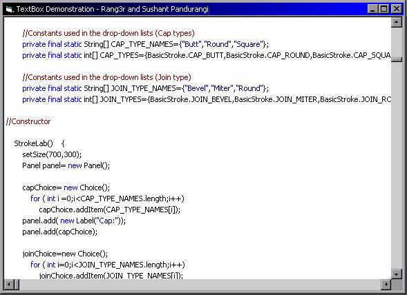



## Complete TextBox in pure code \(no RTFs\) with syntax colouring

### Description

This is a complete TextBox in pure code without any RTF box or anything. It supports custom colour coding, and lots more - now even comment colouring. Also supports external draw events. The Demo is a Java IDE.
 
### More Info
 

             |
---                |---
**Submitted On**   |2001-07-21 16:32:30
**By**             |[sushpa](https://github.com/Planet-Source-Code/PSCIndex/blob/master/ByAuthor/sushpa.md)
**Level**          |Advanced
**User Rating**    |3.6 (18 globes from 5 users)
**Compatibility**  |VB 6\.0
**Category**       |[Custom Controls/ Forms/  Menus](https://github.com/Planet-Source-Code/PSCIndex/blob/master/ByCategory/custom-controls-forms-menus__1-4.md)
**World**          |[Visual Basic](https://github.com/Planet-Source-Code/PSCIndex/blob/master/ByWorld/visual-basic.md)
**Archive File**   |[Complete T233917242001\.zip](https://github.com/Planet-Source-Code/sushpa-complete-textbox-in-pure-code-no-rtfs-with-syntax-colouring__1-25414/archive/master.zip)

